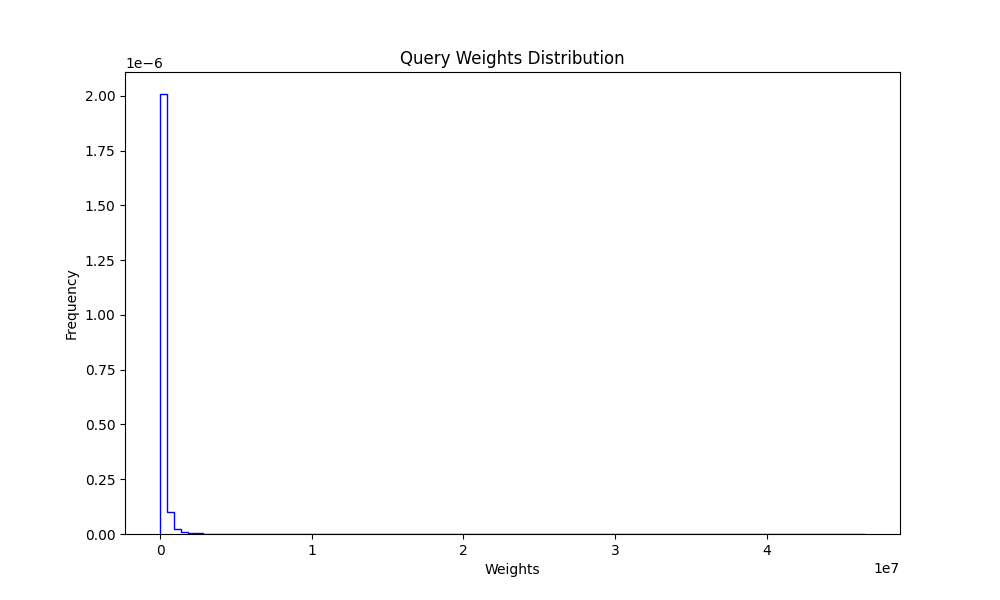
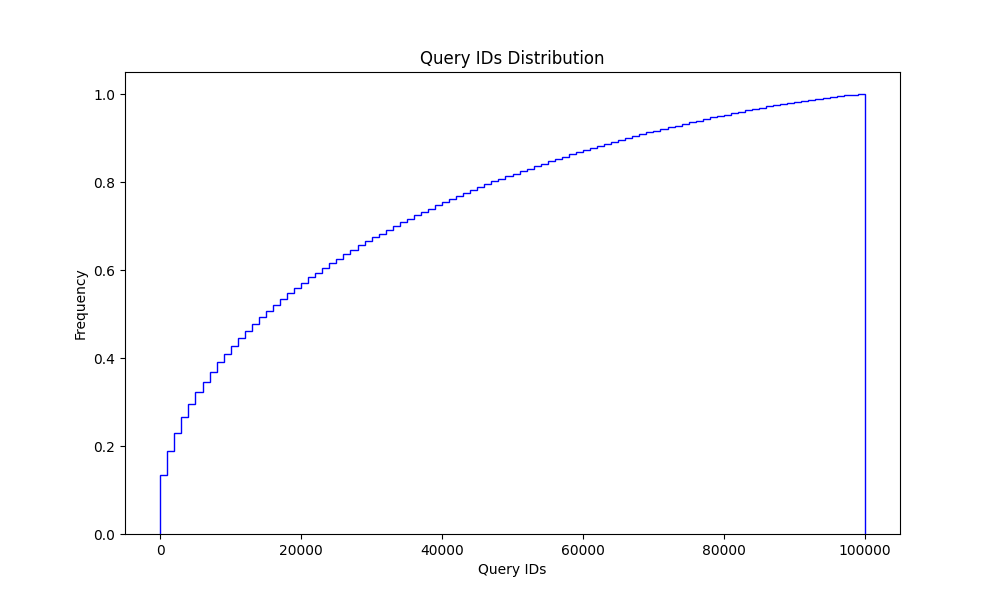
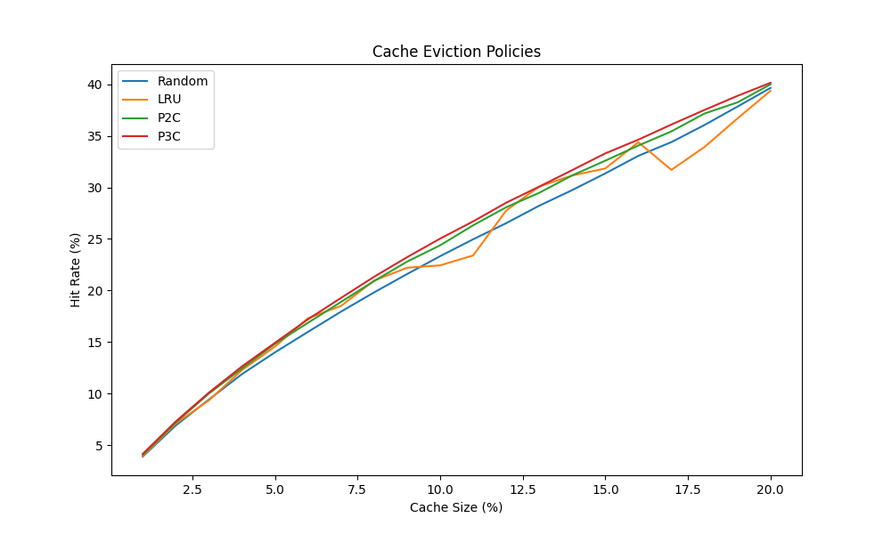
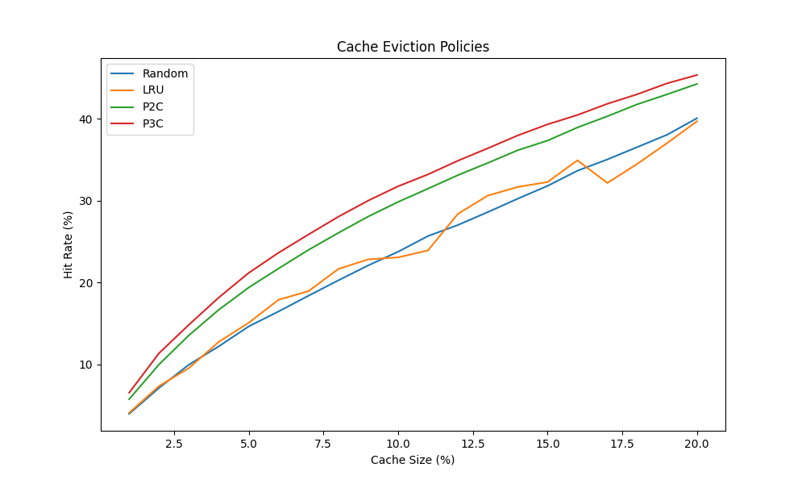

Каждое интервью я провожу для старших инженеров-программистов в Amazon. В этих интервью я задаю более-менее одни и те же вопросы. Один из них предполагает добавление логики кэширования для улучшения результатов. Я заметил, что кандидаты часто совершают две ошибки, которые мешают им выделиться как профессионалам:

1. Они не знают или не обсуждают условия, при которых кэш работает наилучшим образом. В частности, как распределение частоты запросов влияет на производительность кэша.
2. Они не знают стандартную библиотеку выбранного ими языка программирования.

В этой статье мы попытаемся разобраться с этими проблемами.

### Политики

Существуют несколько широко известных политик кэширования:

-   Least Recently Used (LRU) — наименее недавно использованный.
-   Most Recently Used (MRU) — наиболее недавно использованный.
-   Least Frequently Used (LFU) — наименее часто используемый.
-   Random — случайное удаление.
-   Power of N Choices (чаще всего встречается в конфигурациях Power 2 Choices или p2c).

Мы сосредоточимся на LRU, Random и p2c, поскольку их поведение может быть довольно похожим. LRU и p2c явно нацелены на выбор наименее частого или наименее вероятного к повторному запросу, чтобы освободить место для более частых запросов, снижая нагрузку на основной сервис.

LRU активно выбирает наименее частый запрос.  
P2c выполняет аналогичный выбор, выбирая худший из двух вариантов, что в среднем эквивалентно выбору наименее частого запроса, хотя это менее очевидно. Но почему Random добавлен рядом с LRU?

**Примечание**: MRU и LRU довольно близки друг к другу, поэтому мы могли бы рассмотреть MRU, но исключим его, чтобы не усложнять без особой необходимости.

Дело в том, что в политике случайного удаления из кэша (Random) каждый запрос в кэше имеет равную вероятность быть удалённым. Однако вероятность повторного добавления зависит от частоты запросов. Таким образом, более частые запросы быстрее возвращаются в кэш после удаления. Мы докажем это позже.

Когда это работает? Это работает, когда запросы имеют разную частоту. Если частоты равномерно распределены, любая политика кэширования сводится к равномерной вероятности удаления любого запроса. Следовательно, эффективность политики ограничена количеством уникальных запросов, которые кэш может удерживать.

Далее мы рассмотрим простейшие способы реализации кэша на Python и Java — наиболее популярных языках среди кандидатов на интервью, которые я проводил.

### Простые реализации

Вы можете спросить: _«Почему я должен знать все детали стандартной библиотеки, если могу реализовать это сам на интервью и показать, что умею кодить сложные вещи?»_. Причина следующая: знание выбранного вами языка программирования и эффективное его использование демонстрирует, что вы понимаете больше, чем просто синтаксис. Более того, это может позволить вам пропустить базовые вопросы и перейти к более сложным, предназначенным для старших инженеров.

Реализация LRU-кэша на Python удивительно проста:

```python
from functools import lru_cache
......

@lru_cache(maxsize=N)
def foo():
    ...
```

Готово. Всего в две строки.

Вас попросили реализовать что-то вручную вместо использования готовой функции? Вы можете предложить простой гибрид LRU и случайного кэша, который, как мы увидим, настолько же эффективен, как LRU.

```python
cache = {}

def foo(request):
    if request in cache:
        return cache[request]

    result = do_something(request)

    if len(cache) >= N:
        for key in cache:
            break
        del cache[key]

    cache[request] = result
    return result
```

Это работает, потому что:

> Словари сохраняют порядок вставки. Обновление ключа не влияет на порядок. Ключи, добавленные после удаления, вставляются в конец.

(Источник: [официальная документация](https://docs.python.org/3/library/stdtypes.html#dict))

Таким образом, когда мы берем первый ключ из словаря, мы получаем самый старый запрос, который, к тому же, случайно выбран. Эти два фактора вместе придают свойствам реализации сходство с LRU. Запрос должен оставаться в кэше долго, чтобы быть удаленным, и если он удален, то будет добавлен обратно раньше, если он является более частым.

Теперь Java. Реализация немного сложнее, но всё же проще, чем написание полноценного LRU-кэша. Нужно расширить `LinkedHashMap` и переопределить метод следующим образом:

```java
private static final int MAX_ENTRIES = 100;

protected boolean removeEldestEntry(Map.Entry eldest) {
    return size() > MAX_ENTRIES;
}
```

Согласно [официальной документации](https://docs.oracle.com/javase/8/docs/api/java/util/LinkedHashMap.html):

> Пример использования: этот метод позволяет карте вырасти до 100 элементов, после чего при добавлении нового элемента удаляется самый старый, поддерживая постоянное количество в 100 элементов.

А теперь время для тестов.

### Введение к тестам

Я регулярно ищу в интернете статьи, которые сравнивают политики вытеснения кэша, такие как наименее недавно использованный (LRU), случайное удаление (Random) и метод "сила двух выборов" (p2c). Однако каждый раз я не могу найти статью, которая бы отвечала на все мои вопросы или предоставляла нужные мне иллюстрации.  
Похоже, пришло время написать что-то самому.

Мы будем исследовать, как эти политики работают в контексте простого HTTP-сервера. Рассмотрим следующие сценарии:

1. коэффициент попадания в кэш для запросов с равной важностью,
2. время, сэкономленное каждой стратегией,
3. и попробуем оптимизировать одну из стратегий, чтобы ещё больше сократить общее время ожидания.

### Настройка

Наш сервер будет представлять собой функцию на Python, которую мы будем вызывать с различными параметрами. Мы будем кэшировать вызовы этой функции, используя разные стратегии и размеры кэша.

На следующем этапе мы постараемся сделать эксперименты чуть более приближенными к реальной жизни, пусть и не полностью.  
Мы введем задержки для запросов и посмотрим, отличаются ли результаты.

Для моделирования "задержек" мы будем использовать гамма-распределение, так как задержки HTTP-запросов обычно ему следуют.

### Простой кэш-хит

Чтобы наши "запросы" больше походили на реальный трафик, мы сделаем некоторые из них более частыми, чем другие.  
В зависимости от сервиса дисбаланс частоты запросов может быть более или менее выраженным.  
На моем опыте работы в компаниях такая неравномерность запросов была стандартной ситуацией.

Если для вашего сервиса все запросы равновероятны, то коэффициент попадания в кэш равен доле уникальных запросов, которые в него помещаются. Например, если кэш вмещает 20% уникальных запросов, то коэффициент попадания будет близок к 20%.

С использованием следующего кода: [ссылка](./cache-experiments-naive.py),  
мы сгенерировали набор из 100,000 уникальных запросов и набор из 1,000,000 запросов, используя гамма-распределение для генерации весов или частот.  
Затем мы протестировали разные стратегии вытеснения кэша и размеры кэша.

Из этого эксперимента видно, что все четыре стратегии (мы добавили метод "сила трёх выборов" для развлечения) дают схожие результаты. Это делает идею реализации LRU-кэша менее привлекательной, так как p2c гораздо проще реализовать с нуля.

С другой стороны, существует множество готовых реализаций LRU, так что можно выбрать любую. Кого это волнует? Разве что интервьюера на вашем собеседовании.




| Cache Size | Random | LRU    | P2C    | P3C    |
| ---------- | ------ | ------ | ------ | ------ |
| 1          | 3.906  | 3.97   | 4.071  | 4.166  |
| 2          | 6.922  | 7.106  | 7.215  | 7.31   |
| 3          | 9.431  | 9.354  | 10.009 | 10.1   |
| -          | -      | -      | -      | -      |
| 19         | 37.828 | 36.678 | 38.235 | 38.867 |
| 20         | 39.639 | 39.359 | 39.984 | 40.137 |

### Экономия времени ожидания или политика вытеснения кэша на основе полезности запросов

Как мы видели, разница в производительности между известным LRU-кэшем и более простыми стратегиями, такими как случайное удаление, может быть минимальной. Однако p2c (или pNc) обладает интересным свойством: оно позволяет легко описать политику вытеснения кэша как _«сохранять более ценные запросы и удалять остальные»_, где _«ценность»_ может определяться разными способами.

Для имитации LRU мы использовали номер последовательности запросов. Теперь давайте попробуем что-то другое. В реальной жизни мы можем захотеть кэшировать наиболее затратные запросы, поэтому наша метрика полезности может быть определена как `last_seen_timestamp + latency`. Или мы можем чаще удалять менее важные запросы, или использовать другую логику.

Вот результаты для модифицированной политики pNc [ссылка](./cache-experiments-scored.py), которая учитывает оценку, связанную с запросом, и измеряет, сколько _«ценности»_ было сохранено в кэше. На практике оценка может основываться на ответе на запрос, таком как время ожидания, или на любых других метаданных.



| Cache Size | Random  | LRU     | P2C     | P3C     |
| ---------- | ------- | ------- | ------- | ------- |
| 1          | 3.96123 | 4.08413 | 5.74909 | 6.53476 |
| 2          | 7.12508 | 7.34964 | 9.99203 | 11.3669 |
| 3          | 9.96618 | 9.5531  | 13.5536 | 14.8435 |
| -          | -       | -       | -       | -       |
| 19         | 38.0491 | 37.0261 | 42.9838 | 44.3315 |
| 20         | 40.0685 | 39.7009 | 44.2552 | 45.3452 |

### Заключение

Существует несколько политик вытеснения кэша с похожей производительностью, по крайней мере, в некоторых сценариях. Если вы проходите собеседование, может быть хорошей идеей использовать p2c или случайное удаление вместо LRU, так как они проще в реализации, и вы сможете показать, что знаете больше, чем просто LRU. Кроме того, понимание того, почему и как работают политики вытеснения кэша, может сыграть значительную роль как в вашей работе, так и на собеседовании, особенно если вы работаете в команде, которая обрабатывает запросы пользователей.

Ещё один момент, который стоит учитывать: с ростом размера кэша различия в производительности разных политик вытеснения становятся всё менее заметными. Однако если размер кэша относительно небольшой, имеет смысл протестировать несколько политик вытеснения, чтобы найти ту, которая лучше всего подходит для вашего сценария.

Удачи!
