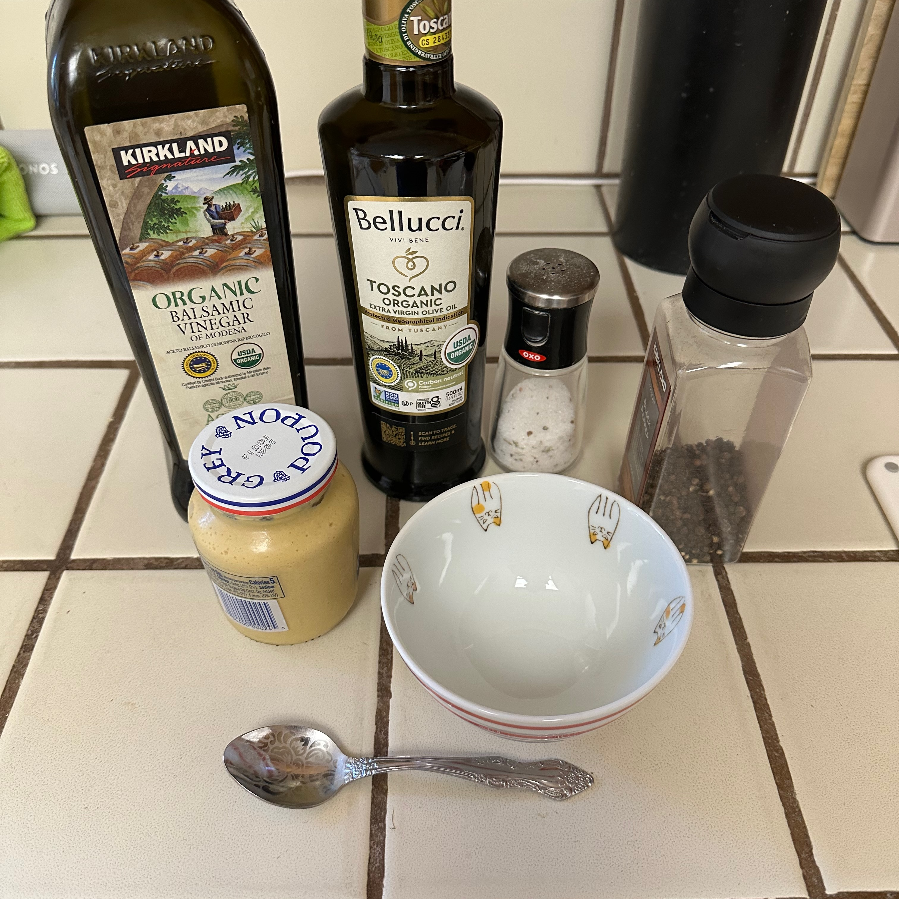
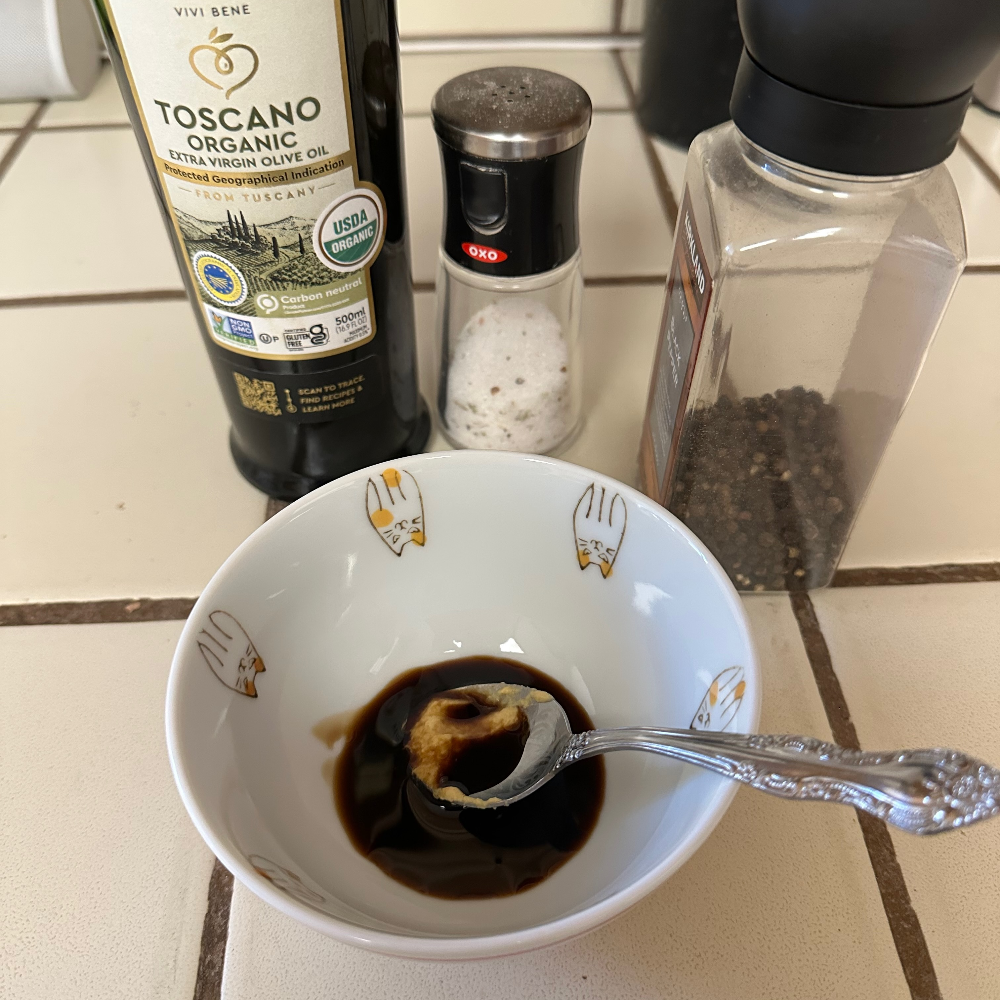
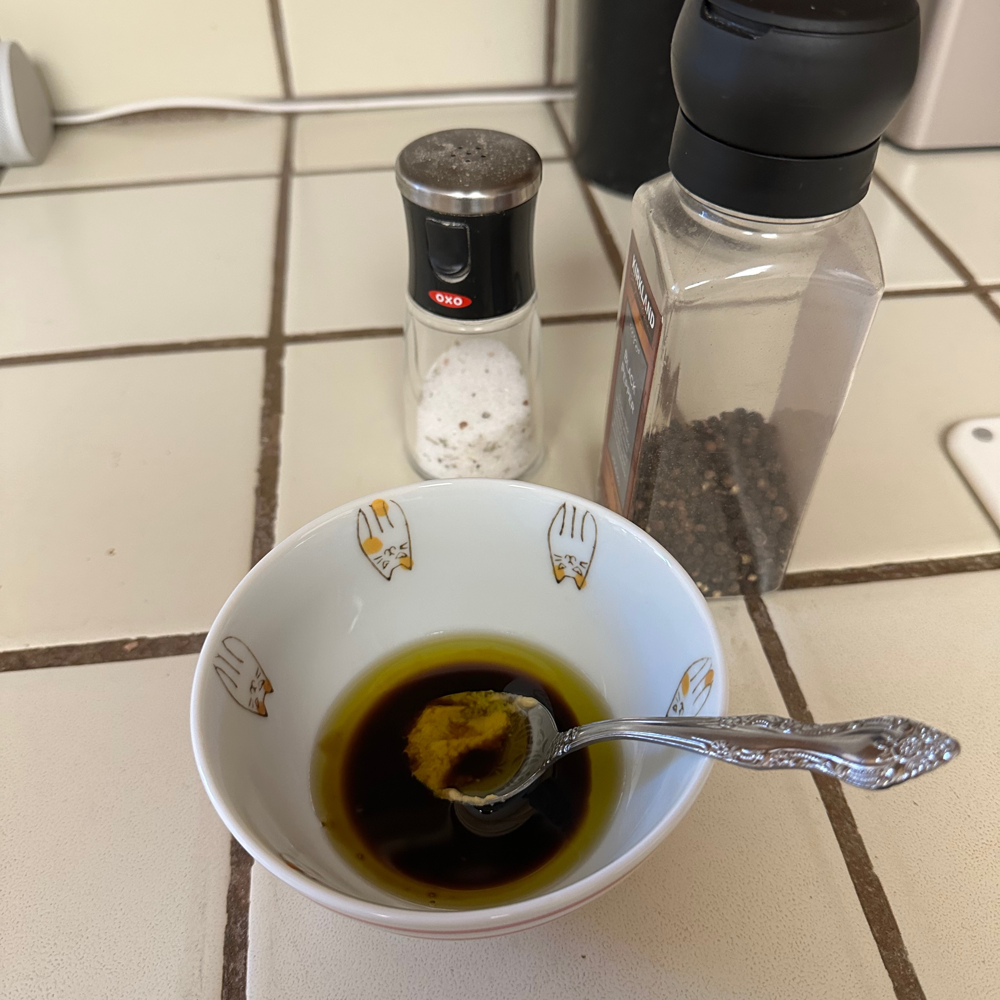
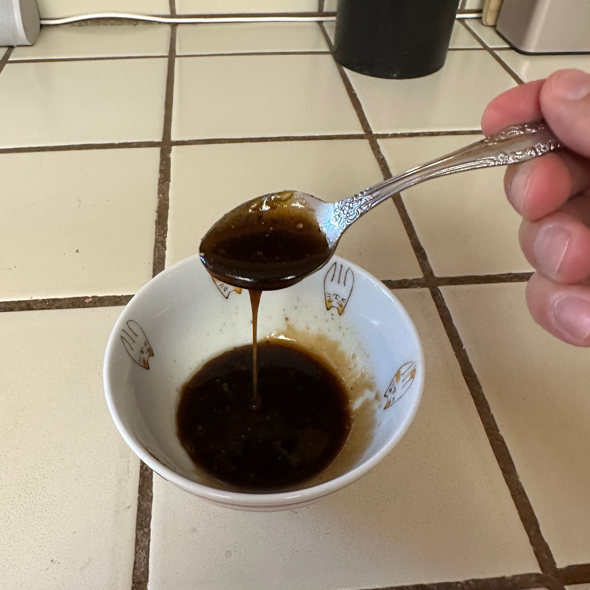

### Ingredients

I have no clue how much of ingredients you will need all measurements are approximate.

-   Balsamic vinegar, or any acidic substance. Try lime juice, it has nice aroma touch. 1 or 2 tbs. Probably.
-   Olive Oil or any oil try peanut oil. 3 or 6 tbs. Who knows how much.
-   Mustard. This thing stabilizes to keep the emulsion. A bit of it.
-   Salt. A pinch?
-   Pepper. A bit.

### The process

Mix everything together and stir for a minute till the emulsion built up.

