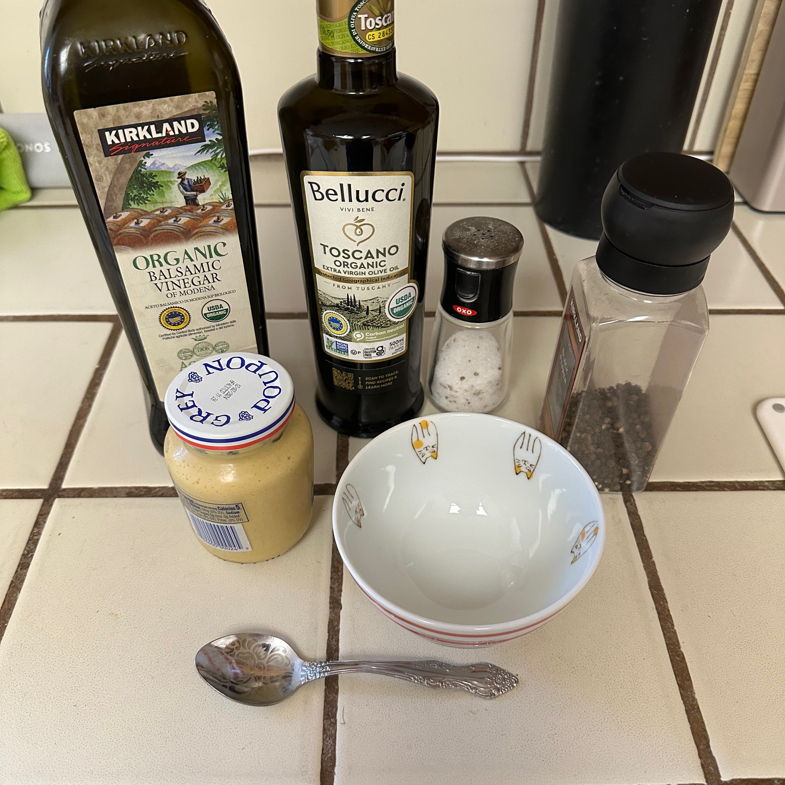
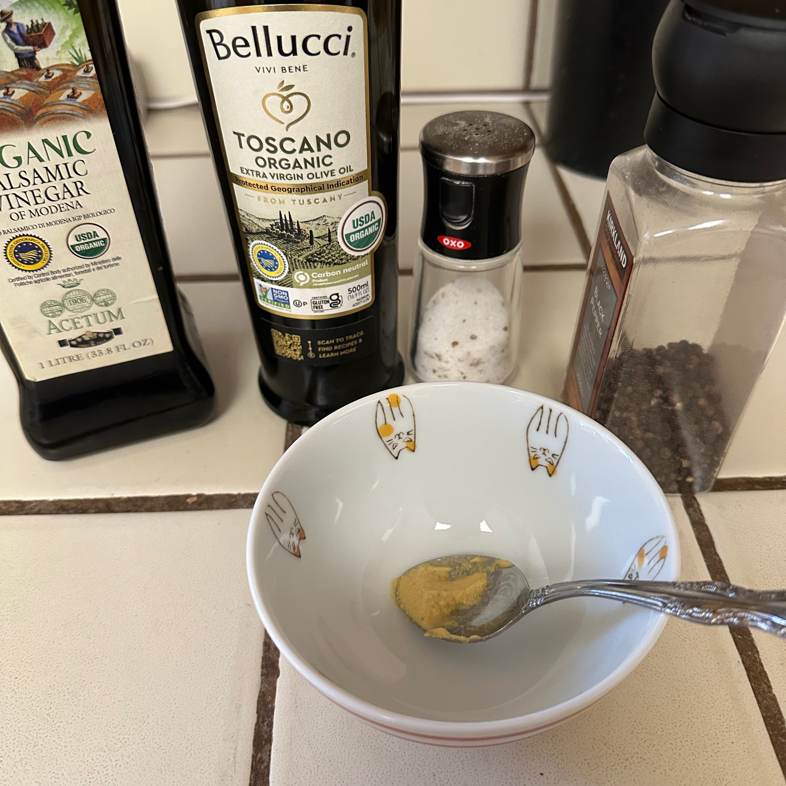
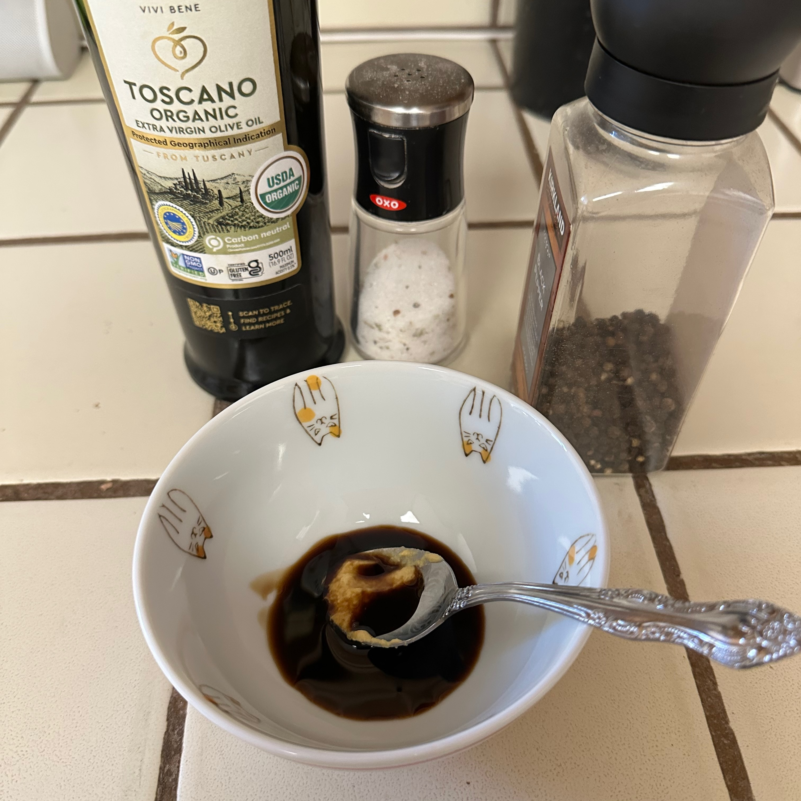
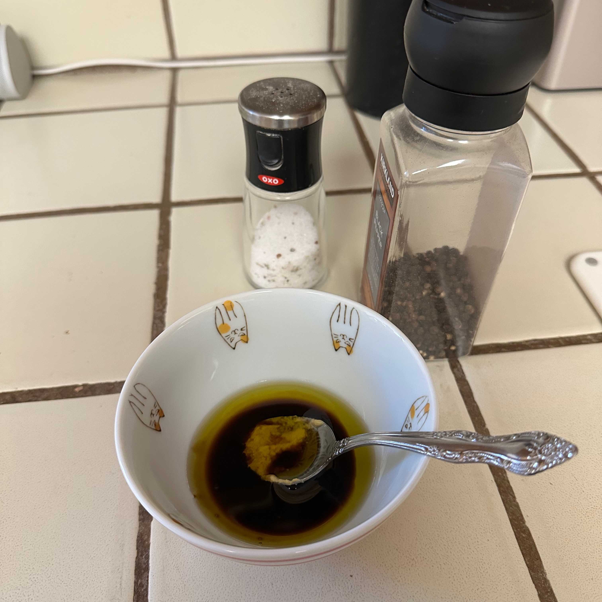
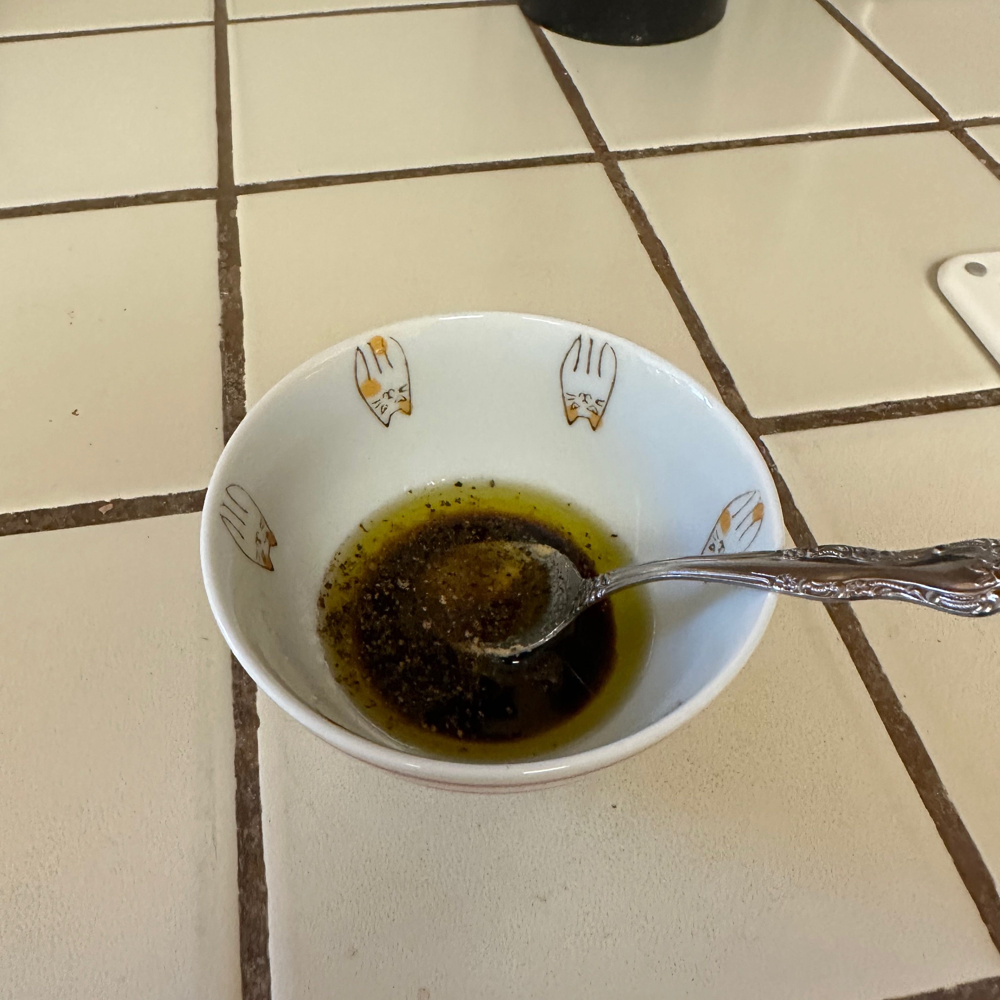
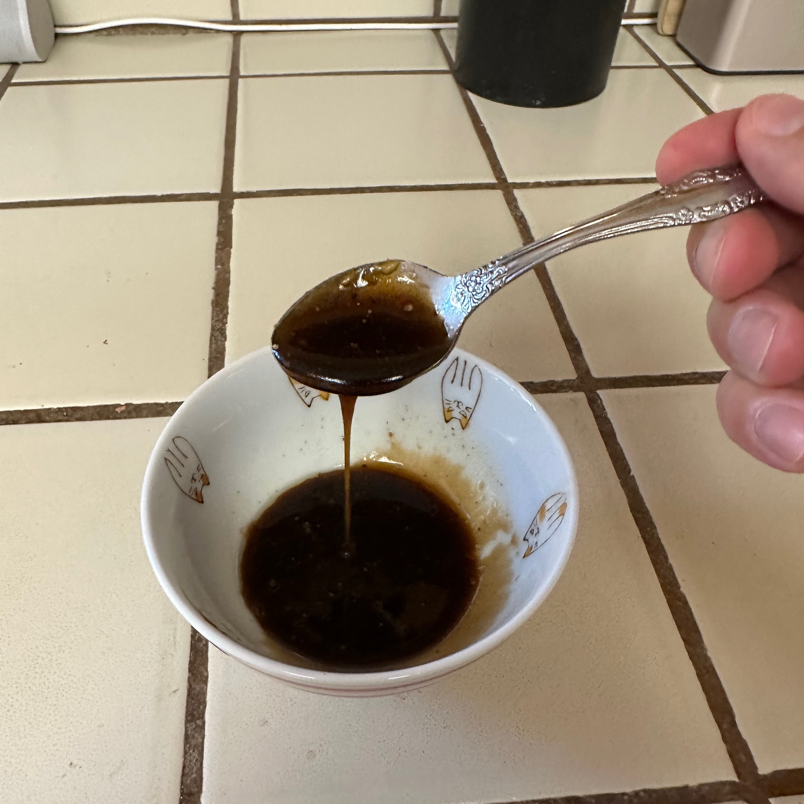

### Ингредиенты

У меня нет понятия, сколько именно ингредиентов вам понадобится, все измерения приблизительны.

-   Бальзамический уксус или любая кислая субстанция. Попробуйте сок лайма — у него приятный аромат. 1–2 ст. ложки. Наверное.
-   Оливковое масло или любое другое масло, попробуйте арахисовое. 3–6 ст. ложек. Кто знает, сколько точно.
-   Горчица. Это стабилизатор, чтобы сохранить эмульсию. Немного.
-   Соль. Щепотка?
-   Перец. Немного.

### Процесс

Смешайте все ингредиенты и перемешивайте минуту, пока не образуется эмульсия.

