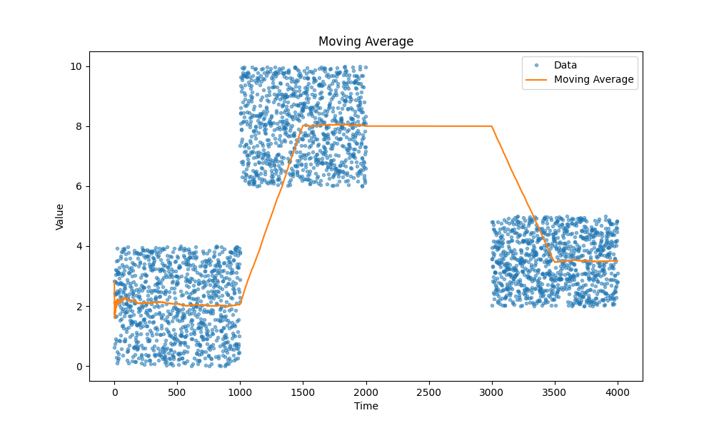
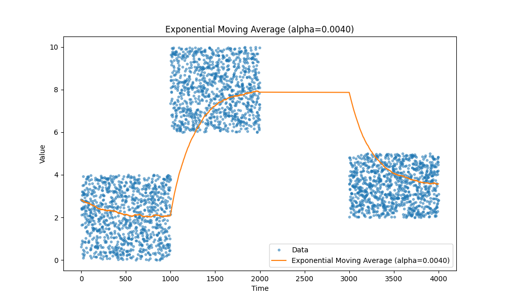
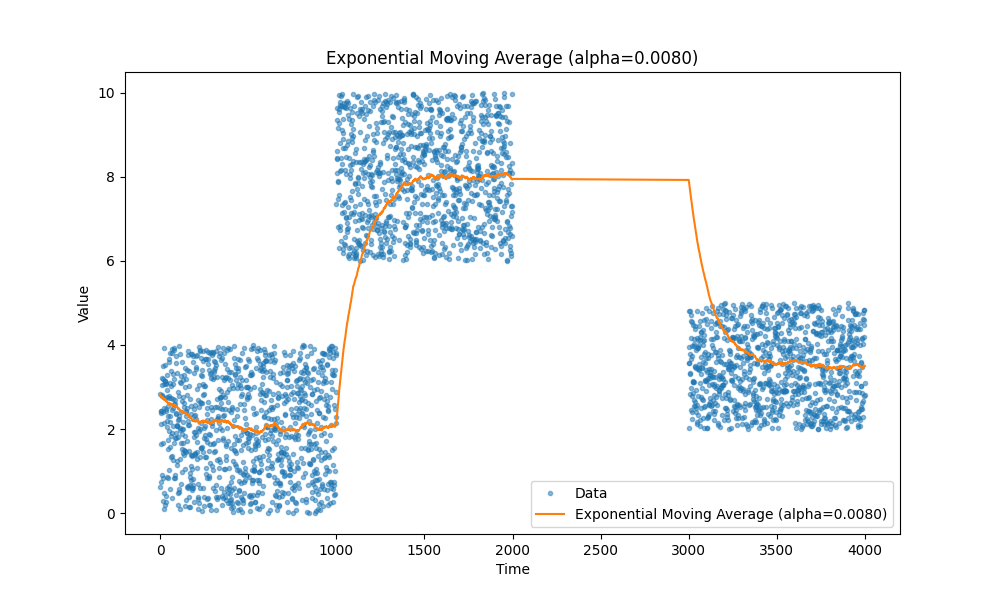
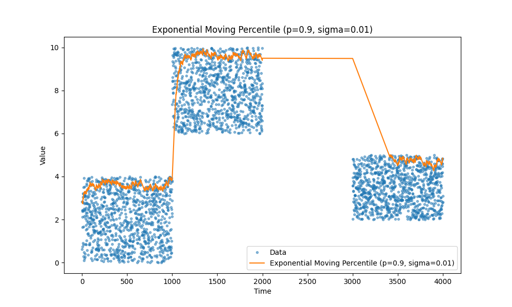
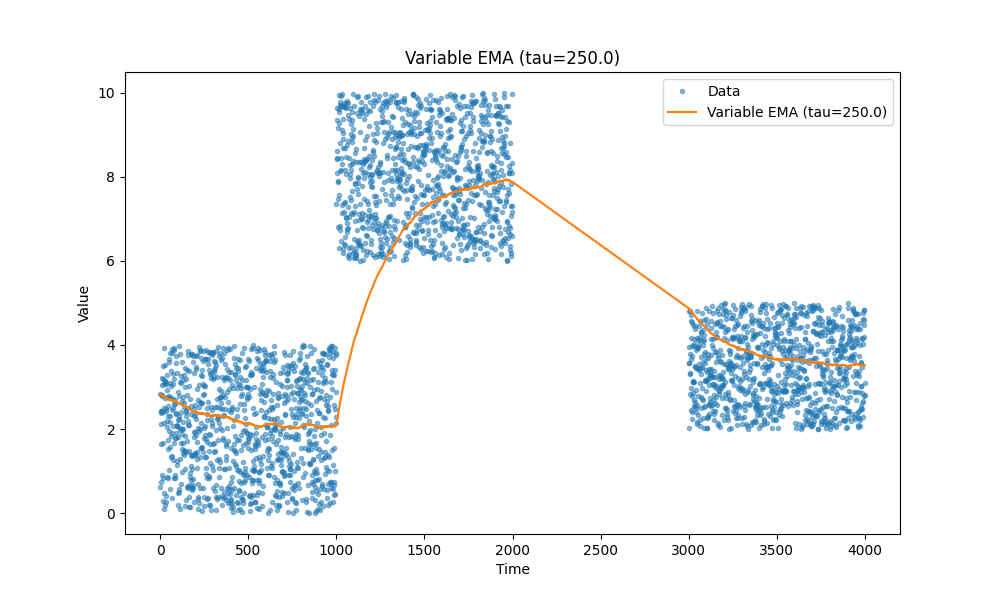
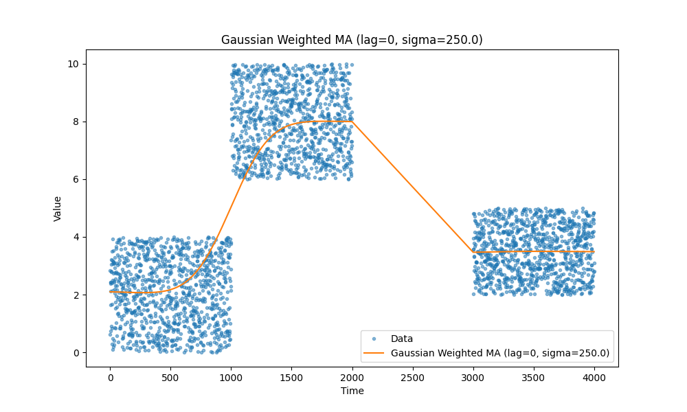

I was curious about use of averaged vector embedding for recommendation purposes, and then
I started wondering if instead of averaging I should try other metrics like median or top percentiles
to focus on more frequent scenarios and reduce the influence of outliers.

And then the question was: imaging that you want to use it in production, how can you compute
averaged embedding for millions of users ideally with instant updates and without offline data processing in bulk.

So I wrote a few tests for the following cases:

1. moving average as a baseline
1. exponential moving average as an option for updates in O(1) (constant time)
1. moving percentiles as a baseline
1. exponential moving percentiles

When I've finished with experiments I realized that I kinda reproduced this articles: https://mjambon.com/2016-07-23-moving-percentile/

I decided to keep it since it provides some insights on influence of different parameters.

Also I think a can offer a few more graphs and a ideas in addition to the original articles.

#### Why?

I used to work with a load balancing code which besides the balancing part also tracked various performance metrics locally and collected metrics from upstream services to balance better.
In that scenario, we can store last 100, 1000, 10k data points but then you need an
efficient code to compute required metrics in constant time so you write additional code, but then the number of parameters you track becomes very large and now you find yourself utilizing a lot of memory for metrics tracking.

#### Moving averages

We all know moving averages, they just work. I personally prefer exponential moving averages as they allow to track different metrics, such as latency, CPU utilization, request size, and so on without a need to store any extra data except a couple variables.

Here are a few examples of moving averages, in case you forgot:

|                 |                 |
| --------------- | --------------- |
|    |   |
|  |  |

#### Moving percentiles

Another type of metrics we often need is percentiles, for example, we are really concerned about tail latency it's let's say 99th percentile or we want to track median instead of average, it is 50th percentile.

Again check out the article, it is a good one: https://mjambon.com/2016-07-23-moving-percentile/

|                     |                     |
| ------------------- | ------------------- |
|        |  |
|  |   |

#### Temporal decay

There is one more, sometimes we want to have a moving average with accepts older data with lower weight, for example, we know that there are natural gaps in the events we track and we want to reduce the influence of the older data points so we have more accurate fresh data faster but we don't want to reject the older data complete but use it as baseline. See those tails going up or down in the beginning of previous graphs the time till an exponential moving average saturates can be large and we want to make it shorter.

The key change is this:

```
delta_t = times[i] - times[i - 1]
alpha = 1 - np.exp(-delta_t / tau)
```

`tau` controls the speed of temporal decay.

|                 |                  |
| --------------- | ---------------- |
|  |  |

You see how nicely it handles that its first data point in the last block of data hits first data point from that block. When in previous cases it was usually a bit higher that the last block.

#### One more way to speed the saturation

Another way to reduce the ramp up lag is to introduce an additional variable let's betta and set it to 0.5 then we slightly modify our formula:

```
alpha_ = alpha + betta
ema = new_value * alpha_ - ema * (1-alpha_)
betta = betta ^ 2
```

this way we start with higher alpha value which will be gradually reduced to the target value after a few initial operations.

#### Gaussian Weighted Moving Average

There is one more. Gaussian Weighted Moving Average is a window based average with a caveat that if give a preference to older/delayed data points.

Unfortunately I didn't come up with a good illustration so sending you to https://www.tradingview.com/script/BCTSMir8-Gaussian-Moving-Average-GA/ and https://towardsdatascience.com/gaussian-smoothing-in-time-series-data-c6801f8a4dc3

|                 |                  |
| --------------- | ---------------- |
|  |  |

#### Finally

So that is it folks. The code is [here](./ma.py)
