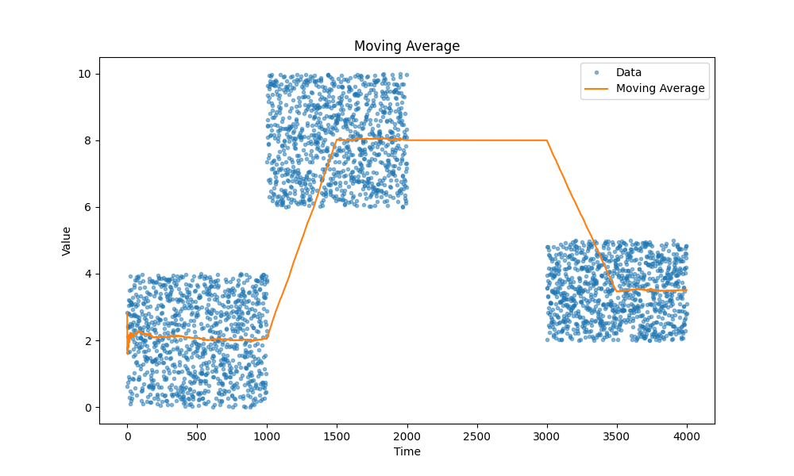
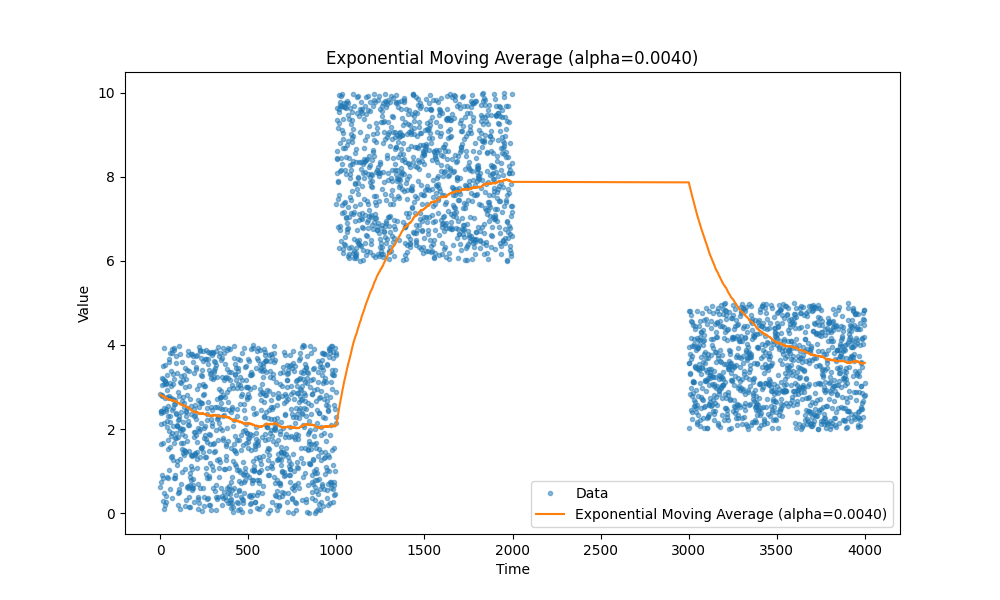
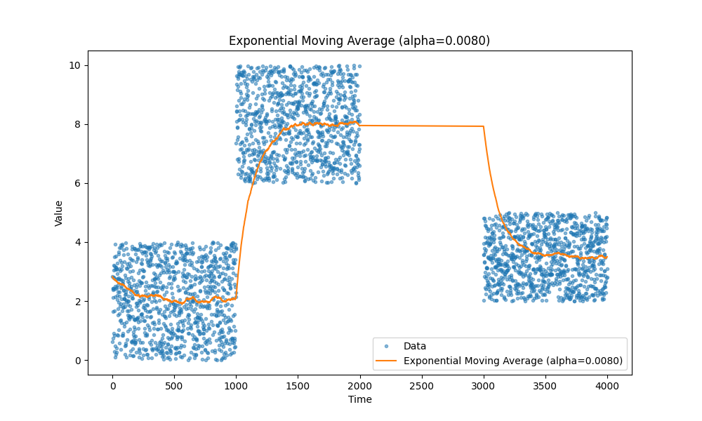
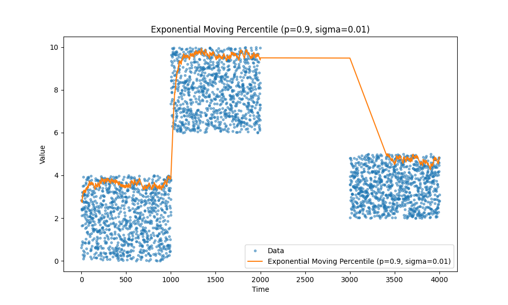
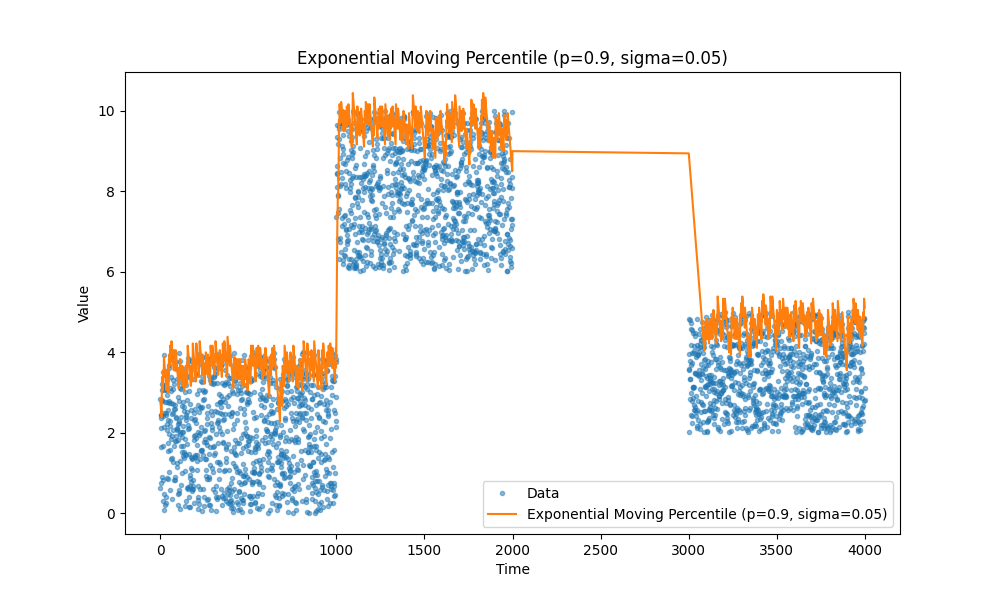
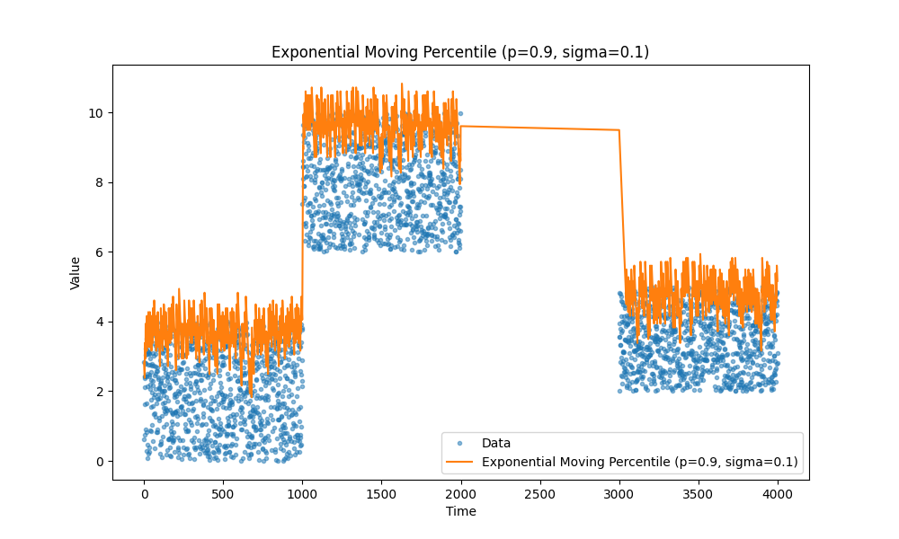
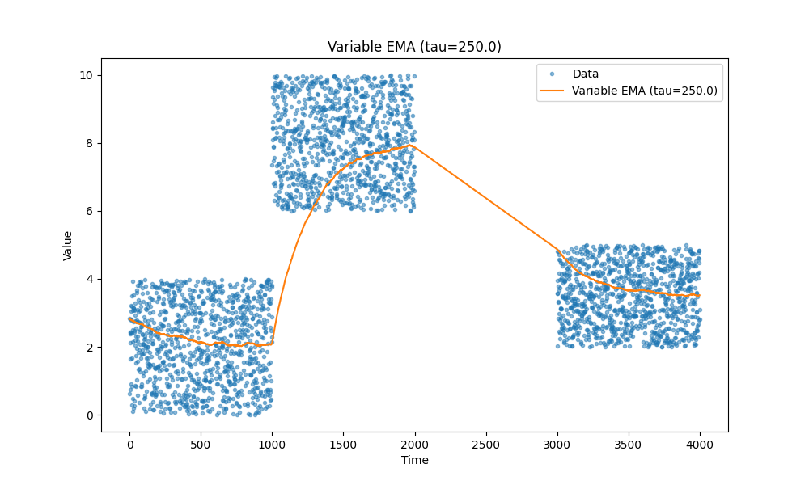
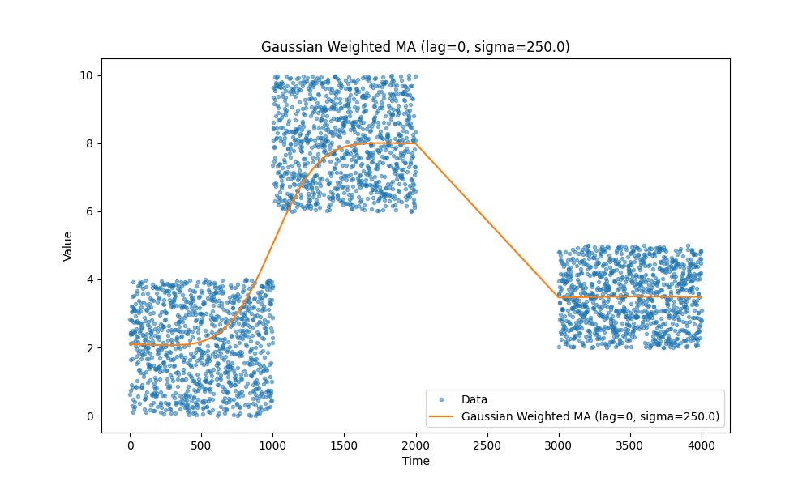

Меня заинтересовало использование усреднённых векторных эмбеддингов для целей рекомендаций, и затем я задумался, а не попробовать ли вместо усреднения использовать другие метрики, такие как медиана или верхние процентили, чтобы сфокусироваться на более частых сценариях и уменьшить влияние выбросов.

А затем возник вопрос: если представить, что вы хотите использовать это в продакшене, как можно вычислить усреднённые эмбеддинги для миллионов пользователей с мгновенными обновлениями и без пакетной обработки данных оффлайн?

Поэтому я написал несколько тестов для следующих случаев:

1. скользящее среднее как базовый вариант;
2. экспоненциальное скользящее среднее как вариант с обновлениями за \(O(1)\) (константное время);
3. скользящие процентили как базовый вариант;
4. экспоненциальные скользящие процентили.

Когда я завершил эксперименты, я понял, что фактически воспроизвёл вот эту статью: [https://mjambon.com/2016-07-23-moving-percentile/](https://mjambon.com/2016-07-23-moving-percentile/).

Я решил оставить это, так как оно даёт некоторые полезные инсайты о влиянии различных параметров.

Кроме того, думаю, я могу предложить несколько дополнительных графиков и идей в дополнение к оригинальной статье.

#### Зачем?

Раньше я работал с кодом балансировки нагрузки, который помимо самой балансировки также отслеживал различные метрики производительности локально и собирал метрики от вышестоящих сервисов для улучшения балансировки.  
В этом сценарии можно хранить последние 100, 1000, 10 тысяч точек данных, но при этом нужен эффективный код для вычисления требуемых метрик за константное время, поэтому вы пишете дополнительный код. Однако затем число параметров, которые вы отслеживаете, становится очень большим, и вы обнаруживаете, что используете много памяти для отслеживания метрик.

#### Скользящие средние

Все мы знаем, как работают скользящие средние — они просто работают. Лично я предпочитаю экспоненциальные скользящие средние, так как они позволяют отслеживать различные метрики, такие как задержка, загрузка CPU, размер запросов и так далее, без необходимости хранить дополнительные данные, кроме пары переменных.

Вот несколько примеров скользящих средних, на случай если вы забыли:

|                 |                 |
| --------------- | --------------- |
|    |   |
|  |  |

#### Скользящие процентили

Ещё один тип метрик, который часто нужен, — это процентили. Например, нас может беспокоить задержка на длинном хвосте, скажем, 99-й процентиль, или мы хотим отслеживать медиану вместо среднего, что соответствует 50-му процентилю.

Опять же, обратите внимание на статью — она действительно хорошая: [https://mjambon.com/2016-07-23-moving-percentile/](https://mjambon.com/2016-07-23-moving-percentile/).

|                     |                     |
| ------------------- | ------------------- |
|        |  |
|  |   |

#### Временное затухание

Есть ещё одна интересная идея: иногда мы хотим, чтобы скользящее среднее учитывало старые данные с меньшим весом. Например, если мы знаем, что в отслеживаемых событиях есть естественные разрывы, мы можем уменьшить влияние более старых точек данных, чтобы быстрее получать более точные свежие данные. При этом мы не хотим полностью игнорировать старые данные, а использовать их как базовую линию. Обратите внимание на те хвосты, которые идут вверх или вниз в начале предыдущих графиков. Время, за которое экспоненциальное скользящее среднее выходит на плато, может быть значительным, и мы хотим его уменьшить.

Ключевое изменение выглядит так:

```python
delta_t = times[i] - times[i - 1]
alpha = 1 - np.exp(-delta_t / tau)
```

`tau` управляет скоростью временного затухания.

|                 |                  |
| --------------- | ---------------- |
|  |  |

Посмотрите, как аккуратно это работает: первая точка данных в последнем блоке данных плавно учитывается относительно первого значения из этого блока. В предыдущих случаях это значение обычно было немного выше последнего блока.

#### Ещё один способ ускорить насыщение

Ещё один способ уменьшить задержку на этапе разогрева — ввести дополнительную переменную, назовём её `betta`, и установить её значение равным 0.5. Затем слегка изменим формулу:

```python
alpha_ = alpha + betta
ema = new_value * alpha_ - ema * (1 - alpha_)
betta = betta ** 2
```

Таким образом, мы начинаем с более высокого значения `alpha`, которое постепенно уменьшается до целевого значения после нескольких начальных операций.

#### Гауссово взвешенное скользящее среднее

Ещё один вариант — гауссово взвешенное скользящее среднее. Это скользящее среднее на основе окна, с особенностью, что оно отдаёт предпочтение более старым или отложенным точкам данных.

К сожалению, у меня не получилось сделать хорошую иллюстрацию, поэтому отправляю вас сюда:  
[https://www.tradingview.com/script/BCTSMir8-Gaussian-Moving-Average-GA/](https://www.tradingview.com/script/BCTSMir8-Gaussian-Moving-Average-GA/)  
и [https://towardsdatascience.com/gaussian-smoothing-in-time-series-data-c6801f8a4dc3](https://towardsdatascience.com/gaussian-smoothing-in-time-series-data-c6801f8a4dc3).

|                 |                  |
| --------------- | ---------------- |
|  |  |

#### Напоследок

Вот и всё, друзья. Код доступен [здесь](./ma.py).
