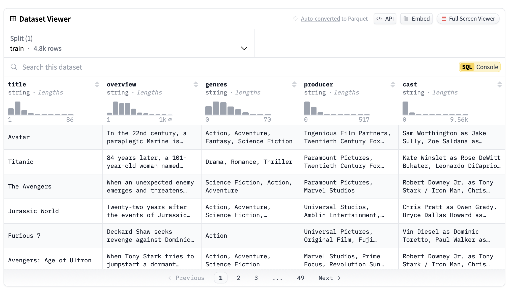

#### Intro

I was reading the original paper on "Hierarchical Navigable Small Worlds (HNSW)" https://arxiv.org/abs/1603.09320 which I found much easier to understand than all those YouTube videos I tried to watch and articles to read. HNSW is a probabilistic data structure for searching neighbors in multi-dimensional space.
One of practical applications is search of semantically close objects. Reading that paper and some other activities made me curious if I can quickly implement a recommendation system which combines three things: HNSW, moving averages, and randomness.

One more challenge I want to add is not to use any tutorials and try to pull everything together using the knowledge I have, except for the documentation for libraries.

#### Recommendation system

I didn't want to spend to much time on it so I decided to use a simple of the shelf components but not too complex too leave room for learning. The main ideas were:

1. we can use an exponential moving average across selected by the user results as a way to build a user profile for recommendations.
1. by adding noise to the user profile, we can implement an exploration mode almost for free.

To build a recommendation system, I decided to use the following ingredients:

1. [A movies dataset from Cohere](https://huggingface.co/datasets/Cohere/movies) as a collection on movies to choose from.
1. [Ollama](https://ollama.com) + `nomic-embed-text` to generate embeddings for movies
1. [Faiss](https://faiss.ai) for HNSW semantic search.

The whole process is quite straight forward:

First we download the dataset

```python
df = pd.read_parquet("hf://datasets/Cohere/movies/movies.parquet")
```

Then we generate embeddings using Ollama and `nomic-embed-text` model

```python
def apply_embedings(row):
    prompt = str(row.to_dict())
    emb = ollama.embeddings(
        model="nomic-embed-text",
        prompt=prompt,
    )
    return emb["embedding"]

tqdm.pandas()
df["embedding"] = df.progress_apply(apply_embedings, axis=1)
```

From the embeddings we build HNSW index and initial user profile:

```python
    # building input for the index which requires a continues piece of memory
    # so numpy comes in handy.
    raw_embs = np.zeros((len(embs), len(embs["embedding"].values[0])), dtype=np.float32)
    for i, (_, row) in enumerate(embs.iterrows()):
        raw_embs[i] = row["embedding"]

    # building index
    dimension = raw_embs.shape[1]
    data_size = raw_embs.shape[0]
    index = faiss.IndexHNSWFlat(dimension, data_size)
    index.add(raw_embs)

    # preparing data for building a user profile
    avg_emb = raw_embs.mean(axis=0)
    min_emb = raw_embs.min(axis=0)
    max_emb = raw_embs.max(axis=0)
    avg_emb.tofile("average_embedding.bin")
    min_emb.tofile("min_embedding.bin")
    max_emb.tofile("max_embedding.bin")

    faiss.write_index(index, "movies.index")
```

Implementation of the search logic is pretty straight forward:

```python
def search(index, query: str, top_k: int = 5):
    emb = apply_embedings(pd.Series({"title": query}))
    D, I = index.search(np.array([emb]), top_k)
    return D, I
```

Then we ask the user to pick one of the movies and then we update user profile by applying EMA to each embedding:

```python
def update_avg_embeddings(pre_emb: np.array, new_emb: np.array, n: int = 8):
    return (pre_emb * n + new_emb) / (n + 1)
....
....
user_emb = update_avg_embeddings(
            user_emb, embs.iloc[I[0][int(movie_id - 1)]]["embedding"], n
        )
```

To generate recommendations we use the same logic as for search but using the user profile as search request:

```python
def get_recommenations(raw_emb: np.array, index, top_k: int = 5):
    D, I = index.search(np.array([raw_emb]), top_k)
    return D, I


D, I = get_recommenations(user_emb, index)
```

For exploratory recommendations we use the same user profile but with added noise:

```python
def randmoize_embedding(emb: np.array, percent_of_change: float = 0.25):
    noise = np.random.normal(1, 1 + percent_of_change, emb.shape)
    negative = random.choice([True, False])
    if negative:
        noise = -noise

    return emb + noise


def randomize_embedding_with_min_max(
    emb: np.array, min_emb: np.array, max_emb: np.array, percent_of_change: float = 0.1
):
    """It selects a percent of buckets in an embedding and randomizes them within the min and max embedding values"""
    new_emb = emb.copy()
    buckets_to_change = random.choices(
        range(emb.shape[0]), k=int(emb.shape[0] * percent_of_change)
    )
    noise = np.random.uniform(min_emb, max_emb, emb.shape)
    new_emb[buckets_to_change] = noise[buckets_to_change]
    return new_emb


random_noise_emb = randmoize_embedding(user_emb)
random_bucket_emb = randomize_embedding_with_min_max(user_emb, min_emb, max_emb)


D, I = get_recommenations(random_noise_emb, index)
rec_noise_msg = print_recommenations("Recommendations (noise):", embs, I)

D, I = get_recommenations(random_bucket_emb, index)
rec_bucket_noise_msg = print_recommenations("Recommendations (buckets):", embs, I)
```

That it is pretty much it.

#### Areas of improvements

The main disadvantage that we added the selected movie to the user profile which may lead to generating recommendations which are close to the watch history of the user.
To mitigate the problem I would try to use a selected movie to find movies close to it and then either use different combinations of them for example:

1. use the next closest movie
1. compute average closest neighbors
1. use weighted average instead of just average or maybe "Gaussian average"

Another area I would experiment with is to make recommendations be time aware so we don't show the user things they may not be interested it any more in the case when the user uses visits quite infrequently with large time gaps between visits. In that case, a temporal decay can be a better option. See: [Moving Averages]( "Moving Averages")

The third thing is to show the user different option type of recommendations and see what they will pick.

You can also try with different approaches to introduce exploration.

#### Testing

The system [code](./src/generate_embedings.py) will ask for a search request and the return search results + recommendations from the previous iteration. It is done this way just because I don't want to spend to much time on making it nicer.

**Attempt number one**: we enter search request `hackers`. The search results are good and we get some default recommendations since the user profile was not updated yet + two sets of recommendations with added noise.

```
Welcome to the movie recommender system

Type 'exit' to quit
Enter a movie title: hackers
+--------------------------+----------------------------+
| Recommendations:         | Recommendations (noise):   |
| 1. Role Models           | 1. Small Apartments        |
| 2. Practical Magic       | 2. Hall Pass               |
| 3. Bringing Out the Dead | 3. Dysfunctional Friends   |
| 4. The Fisher King       | 4. The Chumscrubber        |
| 5. Kiss of Death         | 5. The Exploding Girl      |
+--------------------------+----------------------------+
| Search results:          | Recommendations (buckets): |
| 1. Hackers               | 1. Practical Magic         |
| 2. Gamer                 | 2. Role Models             |
| 3. Antitrust             | 3. The Adjustment Bureau   |
| 4. Micmacs               | 4. Secondhand Lions        |
| 5. Mindhunters           | 5. The Informers           |
+--------------------------+----------------------------+
Pick one of the movies from the search results to update your preferences
Enter a movie number: 5
You selected:
Mindhunters
```

**Second attempt**: we entered `pricess yolo` I have no clue if results have anything to do with the request but we see that recommendation now have `Mindhunters` we selected in the end of previous iteration.

```
Welcome to the movie recommender system

Type 'exit' to quit
Enter a movie title: pricess yolo
+------------------------------------+---------------------------------------------+
| Recommendations:                   | Recommendations (noise):                    |
| 1. Mindhunters                     | 1. Abduction                                |
| 2. Role Models                     | 2. Justin Bieber: Never Say Never           |
| 3. The Death and Life of Bobby Z   | 3. The Past Is a Grotesque Animal           |
| 4. Witless Protection              | 4. The Wailing                              |
| 5. Cape Fear                       | 5. Gory Gory Hallelujah                     |
+------------------------------------+---------------------------------------------+
| Search results:                    | Recommendations (buckets):                  |
| 1. The Goods: Live Hard, Sell Hard | 1. It Follows                               |
| 2. Manderlay                       | 2. See Spot Run                             |
| 3. UHF                             | 3. Cirque du Freak: The Vampire's Assistant |
| 4. Trading Places                  | 4. The Mask                                 |
| 5. Who's Your Caddy?               | 5. Role Models                              |
+------------------------------------+---------------------------------------------+
Pick one of the movies from the search results to update your preferences
Enter a movie number: 2
You selected:
Manderlay
```

**Attempt number three**: we continue to see that search works + recommendations based on EMA of embeddings works just fine. Also bucket level noise seems to give results closed to the original recommendations.

```
Welcome to the movie recommender system

Type 'exit' to quit
Enter a movie title: die hard
+-------------------------------+---------------------------------------------+
| Recommendations:              | Recommendations (noise):                    |
| 1. Manderlay                  | 1. Run All Night                            |
| 2. Mindhunters                | 2. Taxman                                   |
| 3. Cape Fear                  | 3. Cavite                                   |
| 4. Role Models                | 4. Light Sleeper                            |
| 5. The Adjustment Bureau      | 5. 16 Blocks                                |
+-------------------------------+---------------------------------------------+
| Search results:               | Recommendations (buckets):                  |
| 1. Die Hard                   | 1. Manderlay                                |
| 2. Die Hard: With a Vengeance | 2. Blood Diamond                            |
| 3. Die Hard 2                 | 3. City of Angels                           |
| 4. Live Free or Die Hard      | 4. Cirque du Freak: The Vampire's Assistant |
| 5. A Good Day to Die Hard     | 5. A.I. Artificial Intelligence             |
+-------------------------------+---------------------------------------------+
Pick one of the movies from the search results to update your preferences
Enter a movie number: 4
You selected:
Live Free or Die Hard
```

**The last attempt**: the pattern remains.

```
Welcome to the movie recommender system

Type 'exit' to quit
Enter a movie title: show
+----------------------------------+----------------------------+
| Recommendations:                 | Recommendations (noise):   |
| 1. Live Free or Die Hard         | 1. Eagle Eye               |
| 2. Mindhunters                   | 2. Getaway                 |
| 3. Witless Protection            | 3. Road House              |
| 4. The Death and Life of Bobby Z | 4. Rat Race                |
| 5. The Adjustment Bureau         | 5. Ishtar                  |
+----------------------------------+----------------------------+
| Search results:                  | Recommendations (buckets): |
| 1. Best in Show                  | 1. Bringing Out the Dead   |
| 2. UHF                           | 2. Confidence              |
| 3. The Original Kings of Comedy  | 3. The Family Man          |
| 4. The Greatest Show on Earth    | 4. Law Abiding Citizen     |
| 5. Certifiably Jonathan          | 5. Manderlay               |
+----------------------------------+----------------------------+
```

#### Conclusion

The theory that we can use EMA as a way to build user based recommendation without storing history of searches is confirmed.
In addition to that, a bucket based randomness seems to be a good exploration mechanism.

#### The dataset

[A movies dataset from Cohere](https://huggingface.co/datasets/Cohere/movies)


