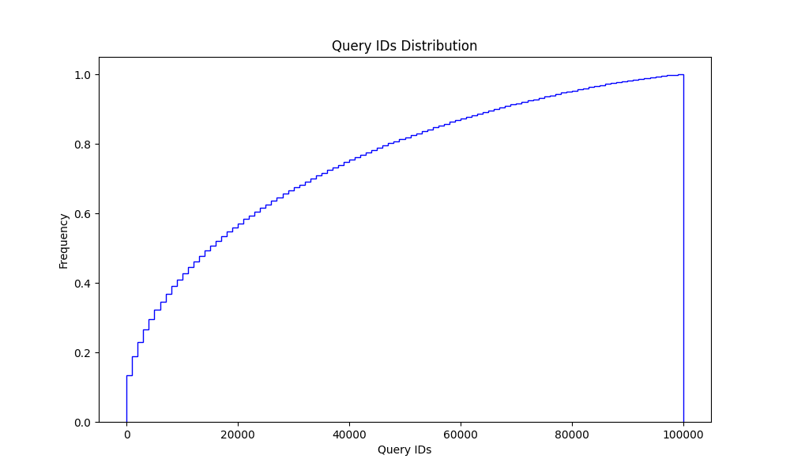
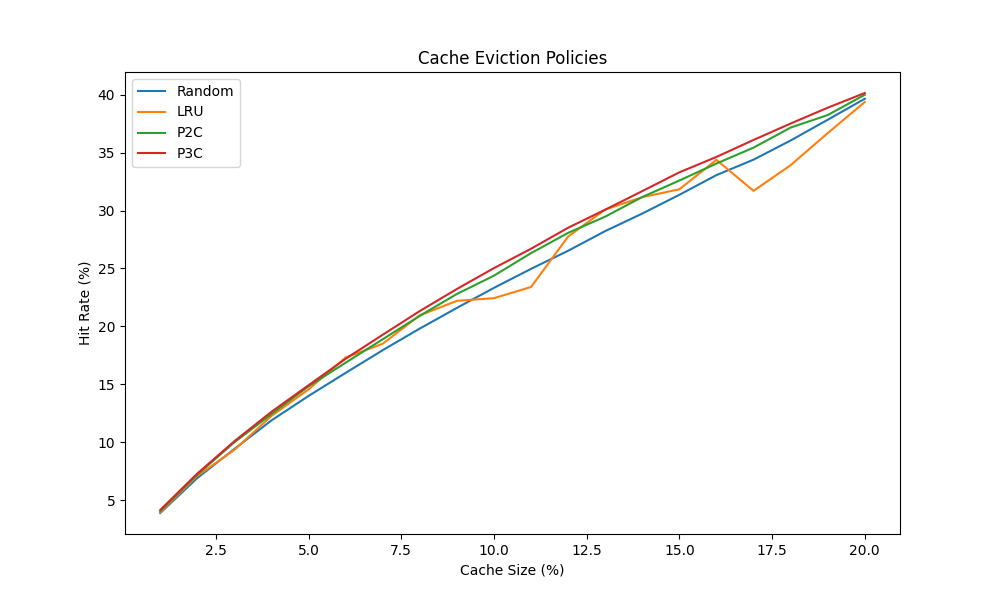
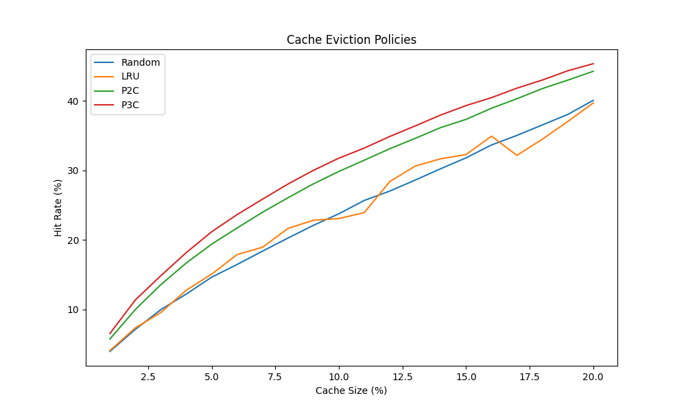

Every so often I interview senior software engineers for Amazon. Where I ask more or less same questions in
each interview. One of them requires adding a caching logic to get better results. I've noticed that the interviewee make one of to mistakes that blocks them from
standing out as a software engineers:

1. they don't know, or talk about conditions under which a cache will do the best. Primarily, how a request frequency distribution affects cache performance.
1. they don't know the standard library of a programming language of their choice.

Here, we will try to address those issues.

### Policies

There are a few well known policies:

-   Least Recently Used (LRU)
-   Most Recently Used (MRU)
-   Least Frequently Used (LFU)
-   Random
-   Power of N choices most frequently seen, in documentation I've read, in configuration of Power 2 Choices or p2c.

Let's focus on LRU, Random, and p2c since they can behave quite similar to each other.
LRU, and p2c clearly tries to pick least frequent or least probable to reappear
requests saving space for more frequent requests and so removing more
load from the service behind it.

LRU picks the least frequent request by actively picking the least frequent query.
P2c does it by picking the worst out of two which average equivalent to picking the least frequent request as well it is just a bit less obvious. But random, why is it added next to LRU?

The thing is that in the random cache eviction policy, each request in a cache has
equal chance to be evicted. However, probability to be added back depends on query
frequency and so more frequent requests repopulate the cache faster than they got
kicked out. We will prove in our next.

When it works? It works when requests has different frequencies if the frequencies
are uniformly distributed then any cache policy degrades to uniformly probability of
eviction for any query. Hence as efficient as number of unique requests in can
keep.

Next, we will have a look at the simplest ways to implement cache in Python, and Java.
The most common languages people picked in the interviews I conducted.

### Simples implementations

You may ask _"Why should I know all bits and piece of the standard library of I can
implement it myself in the interview and show that I can actually code complex things?
"_. The reason is the following: knowing your language of choice and how to
efficiently use shows that you know more than just the syntax and more importantly
may allow you to skip basic questions to more senior level questions.

Implementation of LRU cache in python is amazingly simple:

```python
from functools import lru_cache
......

@lru_cache(maxsize=N)
def foo():
    ...
```

Done. In two lines.

Asked to implement something by your hand instead of using an out of the box
function? You can suggest to implement a simple mix of LRU and random cache which is as we will see as efficient as LRU.

```python
cache = {}

def foo(request):
    if request in cache:
        return cache[request]

    result = do_something(request)

    if len(cache) >= N:
        for key in cache:
            break
        del cache[key]

    cache[request] = result
    return result
```

That works because:

> Dictionaries preserve insertion order. Note that updating a key does not affect the order. Keys added after deletion are inserted at the end.

From [here](https://docs.python.org/3/library/stdtypes.html#dict)

So when we pull the first key from a dictionary to take some that the oldest request and a bit random one. These to combined gives us LRU like properties. Because a request needs to stay for long to be kicked out and once it kicked one it will be added back earlier if it is a more frequent query.

Now Java. It is a bit more complex but still easier than implementing real LRU cache. You need to extend `LinkHashMap` and overload like this:

```Java
private static final int MAX_ENTRIES = 100;

protected boolean removeEldestEntry(Map.Entry eldest) {
return size() > MAX_ENTRIES;
}
```

From [the official documentation](https://docs.oracle.com/javase/8/docs/api/java/util/LinkedHashMap.html):

> Sample use: this override will allow the map to grow up to 100 entries and then delete the eldest entry each time a new entry is added, maintaining a steady state of 100 entries.

And now it is time for tests.

### Tests intro

Every so often I'm search the internet in attempt to find a article which will compare least recently used (LRU), random, and power of two choices (p2c) cache eviction policies and every time I can not find a article that will answer all my question or provide illustrations I looked for.
So it time to write something myself I suppose.

We will be exploring how those policies perform for a simple HTTP server.
We will explore the following cases:

1. cache hit rate for queries of equal importance
2. time saved by each strategy
3. and we will try to optimize one of the strategies to reduce total wait time even further

### Setup

Our server will be a python function which will be called with different parameters. We will cache calls that function using different strategies and cached sizes.

In the next, step we will try to make it a little bit close to the real-life, still far but close.
So here we will introduce query latency and see if the results we are any different.

We will use a gamma distribution to mimic "latency" since HTTP requests latency usually follow it.

### A simple cache hit

To make our "requests" look more like a real traffic we will make some of them more frequent than others.
Depends on the service the query frequency imbalance can be more or less prominent.
In companies I worked for the request imbalance was a very standard situation.

If your service all requests are equally probable then the cache hit rate is equal to the fraction of unique
requests it can fit in. For example, if the cache fits 20% of unique requests, then the hit rate is close to 20% as well.

Using the following code: [link](./cache-experiments-naive.py),
we generated a set of 100,000 unique requests, and a set of request of 1,000,000 requests using gamma distribution to generate weights or frequencies.
Then we tried different cache eviction policies strategies, and different cache sizes.

From this experiment we can see that all four strategies, we added a power of 3 choices just for fun, are close to each other. That makes the idea of implementing an LRU cache cache instead of a simple power of N choices less appealing since p2c is much easier to implement from scratch.

On the other hand there is plenty of LRU implementations so you can pick whatever you like. Who cares? Except probably an interviewer in your job interview.




| Cache Size | Random | LRU    | P2C    | P3C    |
| ---------- | ------ | ------ | ------ | ------ |
| 1          | 3.906  | 3.97   | 4.071  | 4.166  |
| 2          | 6.922  | 7.106  | 7.215  | 7.31   |
| 3          | 9.431  | 9.354  | 10.009 | 10.1   |
| -          | -      | -      | -      | -      |
| 19         | 37.828 | 36.678 | 38.235 | 38.867 |
| 20         | 39.639 | 39.359 | 39.984 | 40.137 |

### Latency savings or eviction policy based on query usefulness

As we saw there can be very little difference in performance between famous LRU cache and more
simpler strategies like random drop. However p2c, or pNc, have a nice property they allow to easily
describe a cache eviction policy as _"keep more valuable queries and drop others"_ where _"valuable"_
can be defined in many ways.

To mimic LRU we used request sequence number. Now let's try something different. In real life, we
may want to cache most expensive queries so our definition of usefulness can be `last_seen_timestamp + latency`.
Or we may want to shed less important queries more frequently or something else.

Here are the results for a modified pNc policy [link](./cache-experiments-scored.py) which takes
into count a score associated with a request and then measures how much _"value"_ was cached.
In practice the score can be based on a query response like latency or any other meta data.



| Cache Size | Random  | LRU     | P2C     | P3C     |
| ---------- | ------- | ------- | ------- | ------- |
| 1          | 3.96123 | 4.08413 | 5.74909 | 6.53476 |
| 2          | 7.12508 | 7.34964 | 9.99203 | 11.3669 |
| 3          | 9.96618 | 9.5531  | 13.5536 | 14.8435 |
| -          | -       | -       | -       | -       |
| 19         | 38.0491 | 37.0261 | 42.9838 | 44.3315 |
| 20         | 40.0685 | 39.7009 | 44.2552 | 45.3452 |

### Conclusion

There are a few policies with similar performance at least in some scenarios. If you are going through
a job interview it may be a good idea to use p2c or random instead of LRU since those are easier to
implement, and you can show that you know more than LRU. In addition to that understating of why, and
how cache eviction policies work can make a huge difference in your work or an interview for a new
job especially for teams which serve queries for the user.

Another thing to keep in mind that as cache size grows differences in performance of different
eviction policies becoming less and less prominent. But if the cache size is rather small it may
make sense to test a few eviction policies to find the one which works the best for your use-case.

Cheers.
